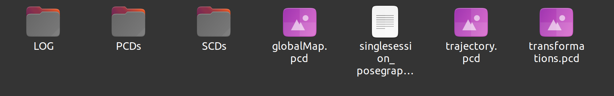
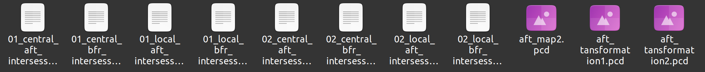
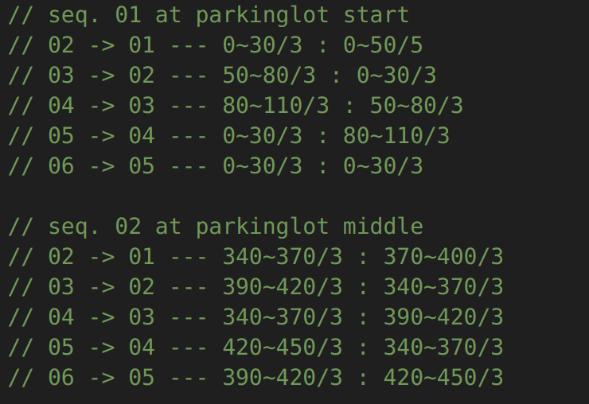
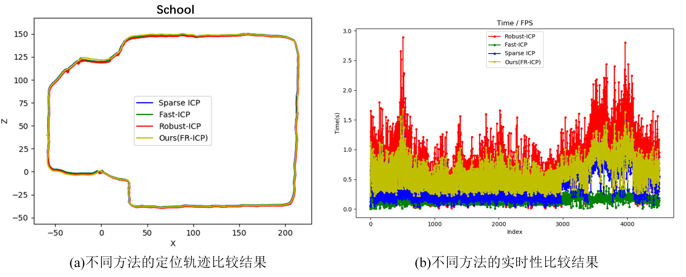

## To be a better FAST-LIO2

## 0 Introdunction
- Front_end: fastlio2 + Dynamic Removal + Yolo(Optional)
- Back_end: Scan Context + GPS(Optional) + GTSAM
- Application: Joint Pose-graph Optimization using iSAM2, Fast and Robust ICP relocalization

## 1 Prerequisites

- Ubuntu 20.04 and ROS Noetic
- PCL >= 1.10 (default for Ubuntu 20.04)
- Eigen >= 3.3.4 (default for Ubuntu 20.04)
- GTSAM >= 4.0.3 (test on 4.2(a))
- [Livox_ros_driver](https://github.com/Livox-SDK/livox_ros_driver)
- [Darknet_ros](https://github.com/leggedrobotics/darknet_ros)

## 3 Build

```shell
cd YOUR_WORKSPACE/src
git clone https://github.com/Yixin-F/better_fastlio2
cd ..
catkin_make
```

## 4 How to Use
### 4.1 LIO Mapping using Livox, Velodyne, Ouster or Robosense

In this section, we developed a more comprehensive FAST-LIO2 version including dynamic removal using SCV-OD (accepted by T-GRS) and YOLO(optional), optimization backend using Scan Context, GPS(optional) and GTSAM. At the same time, we rewritted the mechanism of i-kdtree reconstruction to be suitable for low-power embedded devices.

You can run it by the following commands.
```shell
source ./devel/setup.bash
roslaunch fast_lio_sam mapping_*.launch
```
For other application, you need to first check the Config/*.yaml about the settings for different LiDAR types, we list parameters here. "-" means that it depends on your own project.

| Parameters | 中文解释 | default(默认值) |
| --- | --- | --- |
| lid_topic | 雷达话题名称 | - |
| imu_topic | IMU话题名称 | - |
| time_sync_en | 是否进行时间软同步 | false |
| rootDir | 结果保存根路径 | - |
| savePCD | 是否保存点云帧PCD | true |
| savePCDDirectory | 点云帧PCD保存路径 | PCDs/ |
| saveSCD | 是否保存点云帧SCD | true |
| saveSCDDirectory | 点云帧SCD保存路径 | SCDs/ |
| saveLOG | 是否保存LOG文件 | true |
| saveLOGDirectory | LOG文件保存路径 | LOG/ |
| map_save_en | 是否保存地图 | true |
| pcd_save_interval | -（未使用） | - |
| lidar_type | 雷达类型 | - |
| livox_type | Livox类型 | - |
| scan_line | 雷达线数 | - |
| blind | 无效距离范围(m) | 1.0 |
| feature_enabled | 是否进行特征提取 | false |
| point_filter_num | 有效采样点步长 | 1 |
| scan_rate | 扫描频率 | - |
| time_unit | 时间单位 | - |
| camera_en | 是否使用相机 | false |
| camera_external | 相机到IMU外参 | - |
| camera_internal | 相机内参 | - |
| acc_cov | 线加速度协方差 | 0.1 |
| gyr_cov | 角速度协方差 | 0.1 |
| b_acc_cov | 线加速度偏置协方差 | 0.001 |
| b_gyr_cov | 角速度偏置协方差 | 0.001 |
| fov_degree | 视角范围(deg) | 180.0 |
| det_range | 最远探测距离(m) | 100.0 |
| cube_len | i-kdtree维护立方体边长(m) | 500 |
| extrinsic_est_en | 是否在线标定雷达到IMU外参 | false |
| mappingSurfLeafSize | 点云地图下采样分辨率(m) | 0.2 |
| keyframeAddingDistThreshold | 关键帧平移阈值(m) | 1.0 |
| keyframeAddingAngleThreshold | 关键帧旋转阈值(rad) | 0.2 |
| extrinsic_T | 雷达到IMU平移外参 | - |
| extrinsic_R | 雷达到IMU旋转外参 | - |
| max_iteration | ESEKF最大迭代次数 | 3 |
| recontructKdTree | 是否重建i-kdtree | false |
| kd_step | i-kdtree重建步长 | 50 |
| filter_size_map_min | i-kdtree下采样分辨率(m) | 0.2 |
| loopClosureEnableFlag | 是否开启回环检测 | false |
| loopClosureFrequency | 回环检测频率(hz) | 1.0 |
| historyKeyframeSearchRadius | 有效回环检测搜索半径(m) | 10.0 |
| historyKeyframeSearchTimeDiff | 有效回环检搜索时差(s) | 30.0 |
| historyKeyframeSearchNum | 历史帧搜索个数 | 1 |
| historyKeyframeFitnessScore | icp检验阈值 | 0.2 |
| ground_en | 是否进行地面约束 | false |
| tollerance_en | 是否使用自由度阈值约束 | false |
| sensor_height | 传感器高度(m) | - |
| z_tollerance | z轴约束阈值(m) | 2.0 |
| rotation_tollerance | pitch和roll约束阈值(rad) | 0.2 |
| path_en | 是否发布位姿轨迹 | true |
| scan_publish_en | 是否发布点云 | true |
| dense_publish_en | 是否发布稠密点云 | true |
| scan_bodyframe_pub_en | 是否发布IMU坐标系下点云 | false |
| globalMapVisualizationSearchRadius | i-kdtree搜索距离(m) | 10.0 |
| globalMapVisualizationPoseDensity | i-kdtree位姿采样步长 | 1 |
| globalMapVisualizationLeafSize | i-kdtree可视化下采样分辨率(m) | 0.2 |
| visulize_IkdtreeMap | 是否发布i-kdtree | true |
|  |  |  |

Note that if you wanna use the dynamic removal module, you have to make the "src/laserMapping.cpp [line 2271-2307](./src/laserMapping.cpp#L2271)" effect.

1) Here we list some important functions in src/laserMapping.cpp as follows:

| Function Name | 中文解释 |
| --- | --- |
| [imageCallback](./src/laserMapping.cpp#L250) | usb图像回调函数 720x1280 |
| [paramSetting](./src/laserMapping.cpp#L279) | usb相机内参与外参设置 |
| [BoxCallback](./src/laserMapping.cpp#L292) | yolo目标检测包络框 |
| [publish_frame_world_color](./src/laserMapping.cpp#L310) | 彩色点云发布 |
| [updatePath](./src/laserMapping.cpp#L395) | 更新里程计轨迹 |
| [constraintTransformation](./src/laserMapping.cpp#L425) | 位姿变换限制 |
| [getCurPose](./src/laserMapping.cpp#L436) | 获得当前位姿 |
| [visualizeLoopClosure](./src/laserMapping.cpp#L436) | 发布回环检测marker |
| [saveFrame](./src/laserMapping.cpp#L525) | 保存关键帧 |
| [addOdomFactor](./src/laserMapping.cpp#L550) | 添加激光里程计因子 |
| [addLoopFactor](./src/laserMapping.cpp#L584) | 添加回环因子 |
| [recontructIKdTree](./src/laserMapping.cpp#L612) | i-kdtree重建 |
| [saveKeyFramesAndFactor](./src/laserMapping.cpp#L680) | [关键帧保存、因子添加和因子图优化主函数]() |
| [correctPoses](./src/laserMapping.cpp#L769) | 更新优化后的位姿 |
| [detectLoopClosureDistance](./src/laserMapping.cpp#L815) | 回环检测--近邻搜索 |
| [loopFindNearKeyframes](./src/laserMapping.cpp#L856) | 搜索最近关键帧 |
| [performLoopClosure](./src/laserMapping.cpp#L890) | 回环检测--scan context，回环检测执行 |
| [loopClosureThread](./src/laserMapping.cpp#L856) | [回环检测主函数]() |
| [SigHandle](./src/laserMapping.cpp#L1041) | [ctrl+c 终止函数]() |
| [dump_lio_state_to_log](./src/laserMapping.cpp#L1049) | 保存log文件 |
| [pointBodyToWorld_ikfom](./src/laserMapping.cpp#L1065) | 点云变换到世界坐标系下 |
| [pointBodyToWorld](./src/laserMapping.cpp#L1077) | 点云变换到世界坐标系下 |
| [pointBodyToWorld](./src/laserMapping.cpp#L1090) | 点云变换到世界坐标系下 |
| [RGBpointBodyToWorld](./src/laserMapping.cpp#L1101) | 彩色点云变换到世界坐标系下 |
| [RGBpointBodyLidarToIMU](./src/laserMapping.cpp#L1113) | 彩色点云变换到IMU坐标系下 |
| [points_cache_collect](./src/laserMapping.cpp#L1124) | 删除i-kdtree缓存 |
| [lasermap_fov_segment](./src/laserMapping.cpp#L1136) | FoV视角分割 |
| [standard_pcl_cbk](./src/laserMapping.cpp#L1203) | 标准pcl点云回调函数 |
| [livox_pcl_cbk](./src/laserMapping.cpp#L1228) | livox pcl点云回调函数 |
| [livox_ros_cbk](./src/laserMapping.cpp#L1265) | ros pcl点云回调函数 |
| [imu_cbk](./src/laserMapping.cpp#L1300) | imu回调函数 |
| [LivoxRepubCallback](./src/laserMapping.cpp#L1330) | - |
| [map_incremental](./src/laserMapping.cpp#L1440) | i-kdtree增量管理 |
| [publish_frame_world](./src/laserMapping.cpp#L1502) | 发布世界坐标系下点云 |
| [publish_frame_body](./src/laserMapping.cpp#L1543) | 发布IMU坐标系下点云 |
| [publish_effect_world](./src/laserMapping.cpp#L1560) | 发布世界坐标系下有效点云 |
| [publish_map](./src/laserMapping.cpp#L1577) | 发布世界坐标系下i-kdtree点云 |
| [publish_effect_world](./src/laserMapping.cpp#L1588) | 设置位姿 |
| [set_posestamp](./src/laserMapping.cpp#L1560) | 发布世界坐标系下有效点云 |
| [publish_odometry](./src/laserMapping.cpp#L1602) | 发布里程计 |
| [publish_path_imu](./src/laserMapping.cpp#L1637) | 发布IMU轨迹 |
| [publish_path](./src/laserMapping.cpp#L1646) | 发布未优化位姿 |
| [publish_path_update](./src/laserMapping.cpp#L1673) | 发布优化后位姿 |
| [CreateFile](./src/laserMapping.cpp#L1691) | 创建文件夹 |
| [savePoseService](./src/laserMapping.cpp#L1702) | 位姿保存服务 |
| [saveMapService](./src/laserMapping.cpp#L1737) | 地图保存服务 |
| [savePoseService](./src/laserMapping.cpp#L1702) | 位姿保存服务 |
| [saveMap](./src/laserMapping.cpp#L1813) | 地图保存触发 |
| [publishGlobalMap](./src/laserMapping.cpp#L1825) | 发布世界坐标系下关键帧点云 |
| [h_share_model](./src/laserMapping.cpp#L1876) | [观测更新主函数]() |
| [main](./src/laserMapping.cpp#L2006) | [里程计主函数]() |
|  |  |

2) Here we list some important functions in include/dynamic-remove/tgrs.cpp as follows:

| Function Name | 中文解释 |
| --- | --- |
| [mergeClusters](./include/dynamic-remove/tgrs.cpp#L4) | 聚类覆盖 |
| [findVoxelNeighbors](./include/dynamic-remove/tgrs.cpp#L12) | 搜索近邻体素 |
| [cluster](./include/dynamic-remove/tgrs.cpp#L30) | [聚类主函数]() |
| [getBoundingBoxOfCloud](./include/dynamic-remove/tgrs.cpp#L111) | 获取聚类物体boundingbox |
| [getCloudByVec](./include/dynamic-remove/tgrs.cpp#L117) | 使用vector提取点云 |
| [recognizePD](./include/dynamic-remove/tgrs.cpp#L125) | [识别潜在动态物体主函数]() |
| [trackPD](./include/dynamic-remove/tgrs.cpp#L141) | [跟踪潜在动态物体主函数]() |
| [saveColorCloud](./include/dynamic-remove/tgrs.cpp#L214) | 按照聚类类别保存彩色点云 |
|  |  |

3) Here we list some important functions in include/sc-relo/Scancontext.cpp as follows:

| Function Name | 中文解释 |
| --- | --- |
| [coreImportTest](./include/sc-relo/Scancontext.cpp#L8) | - |
| [rad2deg](./include/sc-relo/Scancontext.cpp#L13) | rad2deg |
| [deg2rad](./include/sc-relo/Scancontext.cpp#L18) | deg2rad |
| [xy2theta](./include/sc-relo/Scancontext.cpp#L23) | xy2theta |
| [circshift](./include/sc-relo/Scancontext.cpp#L45) | 矩阵行平移 |
| [eig2stdvec](./include/sc-relo/Scancontext.cpp#L67) | 矩阵转换为vector |
| [distDirectSC](./include/sc-relo/Scancontext.cpp#L80) | sc矩阵距离计算 |
| [fastAlignUsingVkey](./include/sc-relo/Scancontext.cpp#L114) | sc矩阵列匹配 |
| [distanceBtnScanContext](./include/sc-relo/Scancontext.cpp#L146) | sc矩阵相似度计算 |
| [makeScancontext](./include/sc-relo/Scancontext.cpp#L195) | sc生成 |
| [makeRingkeyFromScancontext](./include/sc-relo/Scancontext.cpp#L260) | ring生成 |
| [makeSectorkeyFromScancontext](./include/sc-relo/Scancontext.cpp#L283) | sector对应 |
| [makeAndSaveScancontextAndKeys](./include/sc-relo/Scancontext.cpp#L304) | [sc生成主函数]() |
| [saveScancontextAndKeys](./include/sc-relo/Scancontext.cpp#L326) | sc插入 |
| [detectLoopClosureIDBetweenSession](./include/sc-relo/Scancontext.cpp#L337) | [multi-session重定位检测主函数]() |
| [getConstRefRecentSCD](./include/sc-relo/Scancontext.cpp#L398) | sc获取 |
| [detectClosestKeyframeID](./include/sc-relo/Scancontext.cpp#L402) | 回环帧ID获取 |
| [detectLoopClosureID](./include/sc-relo/Scancontext.cpp#L507) | 回环帧ID获取 |
| [saveCurrentSCD](./include/sc-relo/Scancontext.cpp#L515) | scd保存 |
| [loadPriorSCD](./include/sc-relo/Scancontext.cpp#L534) | [multi-session加载先验scd]() |
| [relocalize](./include/sc-relo/Scancontext.cpp#L565) | [multi-session重定位主函数]() |
|  |  |

After you have run the command, there are several files being generated in the filefold "rootDir/*" as follows:



| File Name | 中文解释 |
| --- | --- |
| LOG | 日志文件 |
| PCDs | PCD格式 关键帧点云 |
| SCDs | SCD格式 关键帧Scan Context描述子 |
| globalMap.pcd | PCD格式 全局地图 |
| singlesession_posegraph.g2o | g2o格式 全局位姿图 |
| trajectory.pcd | PCD格式 xyz位姿轨迹 |
| transformations.pcd | PCD格式 xyz+rpy位姿轨迹 |
|  |  |

We show some simple results:


### 4.2 Multi-session Mapping
```shell
source ./devel/setup.bash
roslaunch fast_lio_sam multi_session.launch
```

You also need to first check the Config/multi_session.yaml, we list parameters here. "-" means that it depends on your own project.

| Parameters | 中文解释 | default(默认值) |
| --- | --- | --- |
| sessions_dir | 存储多个lio结果的根路径 | - |
| central_sess_name | 中心阶段lio文件名称 | - |
| query_sess_name | 子阶段lio文件名称 | - |
| save_directory | 多阶段结果保存路径 | - |
| iteration | isam2迭代优化次数 | 3 |
|  |  |  |

Here we list some important functions in include/multi-session/incremental_mapping.cpp as follows:

| Function Name | 中文解释 |
| --- | --- |
| [fileNameSort](./include/multi-session/Incremental_mapping.cpp#L3) | 文件名称排序 |
| [pairIntAndStringSort](./include/multi-session/Incremental_mapping.cpp#L15) | std::pair排序 |
| [Session](./include/multi-session/Incremental_mapping.cpp#L20) | [单阶段类构建函数]() |
| [initKeyPoses](./include/multi-session/Incremental_mapping.cpp#L37) | 位姿初始化 |
| [updateKeyPoses](./include/multi-session/Incremental_mapping.cpp#L77) | 位姿更新 |
| [loopFindNearKeyframesCentralCoord](./include/multi-session/Incremental_mapping.cpp#L97) | 搜索中心位姿图中的近邻位姿 |
| [loopFindNearKeyframesLocalCoord](./include/multi-session/Incremental_mapping.cpp#L119) | 搜索子位姿图中的近邻位姿 |
| [loadSessionKeyframePointclouds](./include/multi-session/Incremental_mapping.cpp#L142) | 加载关键帧点云 PCD格式 |
| [loadSessionScanContextDescriptors](./include/multi-session/Incremental_mapping.cpp#L194) | 加载关键帧sc SCD格式 |
| [loadSessionGraph](./include/multi-session/Incremental_mapping.cpp#L232) | 加载位姿图 PCD格式 |
| [loadGlobalMap](./include/multi-session/Incremental_mapping.cpp#L267) | 加载点云地图 |
| [getPoseOfIsamUsingKey](./include/multi-session/Incremental_mapping.cpp#L285) | 从isam2中获取位姿 |
| [writeAllSessionsTrajectories](./include/multi-session/Incremental_mapping.cpp#L293) | 保存单阶段位姿图 G2O格式 |
| [run](./include/multi-session/Incremental_mapping.cpp#L349) | [联合位姿图优化主函数]() |
| [initNoiseConstants](./include/multi-session/Incremental_mapping.cpp#L382) | 初始化噪声 |
| [initOptimizer](./include/multi-session/Incremental_mapping.cpp#L416) | 初始化isam2优化器 |
| [updateSessionsPoses](./include/multi-session/Incremental_mapping.cpp#L424) | 根据anchor更新位姿图 |
| [optimizeMultisesseionGraph](./include/multi-session/Incremental_mapping.cpp#L435) | [位姿图更新主函数]() |
| [doICPVirtualRelative](./include/multi-session/Incremental_mapping.cpp#L462) | ICP验证 |
| [doICPGlobalRelative](./include/multi-session/Incremental_mapping.cpp#L525) | ICP验证 |
| [detectInterSessionSCloops](./include/multi-session/Incremental_mapping.cpp#L586) | [sc重定位主函数]() |
| [detectInterSessionRSloops](./include/multi-session/Incremental_mapping.cpp#L619) | [rs重定位主函数]() |
| [equisampleElements](./include/multi-session/Incremental_mapping.cpp#L635) | sc重定位std::pair保存 |
| [addSCloops](./include/multi-session/Incremental_mapping.cpp#L651) | [sc重定位因子添加主函数]() |
| [calcInformationGainBtnTwoNodes](./include/multi-session/Incremental_mapping.cpp#L699) | [重定位优化残差主函数]() |
| [findNearestRSLoopsTargetNodeIdx](./include/multi-session/Incremental_mapping.cpp#L729) | rs重定位std::pair保存 |
| [addRSloops](./include/multi-session/Incremental_mapping.cpp#L787) | [rs重定位因子添加主函数]() |
| [addSClinitTrajectoryByAnchoringoops](./include/multi-session/Incremental_mapping.cpp#L840) | [anchor生成主函数]() |
| [addSessionToCentralGraph](./include/multi-session/Incremental_mapping.cpp#L853) | 添加节点 |
| [loadAllSessions](./include/multi-session/Incremental_mapping.cpp#L894) | 加载文件名称 |
| [visualizeLoopClosure](./include/multi-session/Incremental_mapping.cpp#L928) | 可视化重定位因子边 |
| [loadCentralMap](./include/multi-session/Incremental_mapping.cpp#L1053) | 加载中心地图 |
| [getReloKeyFrames](./include/multi-session/Incremental_mapping.cpp#L1080) | [获得重定位关键帧主函数]() |
|  |  |

If you wanna run this multi-session module, you should have two-stage results from the LIO mapping module, more details can be found in the last section. We give examples on Parkinglot Dataset here.


| File Name | 中文解释 |
| --- | --- |
| 01 ~ 02 | 01 ~ 02 的单阶段 lio mapping 结果，文件格式同 4.1 |
| 01** | ** 对 01 的 multi-session 结果 |
|  |  |

We show the details in file "0102" as follows:



| File Name | 中文解释 |
| --- | --- |
| 01_central_aft_intersession_loops.txt | TXT格式 multi-session后 中心坐标系下01位姿轨迹 |
| 01_central_bfr_intersession_loops.txt | TXT格式 multi-session前 中心坐标系下01位姿轨迹 |
| 01_local_aft_intersession_loops.txt | TXT格式 multi-session后 子坐标系下01位姿轨迹  |
| 01_local_bfr_intersession_loops.txt | TXT格式 multi-session前 子坐标系下01位姿轨迹  |
| 02_central_aft_intersession_loops.txt | TXT格式 multi-session后 中心坐标系下02位姿轨迹 |
| 02_central_bfr_intersession_loops.txt | TXT格式 multi-session前 中心坐标系下02位姿轨迹 |
| 02_local_aft_intersession_loops.txt | TXT格式 multi-session后 子坐标系下02位姿轨迹 |
| 02_local_bfr_intersession_loops.txt | TXT格式 multi-session前 子坐标系下02位姿轨迹 |
| aft_map2.pcd | PCD格式  multi-session后 中心坐标系下0102拼接地图|
| aft_transformation1.pcd | PCD格式  multi-session后 中心坐标系下01地图 |
| aft_transformation2.pcd | PCD格式  multi-session后 中心坐标系下02地图 |
|  |  |

We show some simple results:


### 4.3 Object-level Updating
```shell
source ./devel/setup.bash
roslaunch fast_lio_sam object_update.launch
```

Note that we just update the local map in similar area, so if you wanna test object-level updating, you should manually select these areas like that we show you in src/object_update.cpp [line 235~383](./src/object_update.cpp#L235).



The upper part means that we choose the 0-50 frames with skip as 5 in 01 to update the 0-30 frames with skip as 3 in 02. Remember that you can change the skip by rewritting the "i" in for-loop. We finally get the updated map of 01.


| File Name | 中文解释 |
| --- | --- |
| prior_map_select.pcd | PCD格式 先验被更新地图的区域 |
| cur_map_select.pcd | PCD格式 当前更新地图的区域 |
| result.pcd | PCD格式 更新地图结果 |
|  |  |

### 4.4 Online Relocalization
```shell
source ./devel/setup.bash
roslaunch fast_lio_sam online_relocalization.launch
roslaunch fast_lio_sam mapping_*.launch
rosbag play -r * *.bag
```
You also need to first check the Config/online_relocalization.yaml, we list parameters here. "-" means that it depends on your own project.

| Parameters | 中文解释 | default(默认值) |
| --- | --- | --- |
| priorDir | 先验知识根路径 | - |
| cloudTopic | lio点云发布话题 | - |
| poseTopic | lio位姿发布话题 | - |
| searchDis | 近邻先验关键帧搜索半径(m) | 5.0 |
| searchNum | 近邻先验关键帧搜索个数 | 3 |
| trustDis | 区域覆盖搜索半径(m) | 5.0 |
| regMode | 配准方法 | 4 |
| extrinsic_T | 雷达到IMU平移外参 | - |
| extrinsic_R | 雷达到IMU旋转外参 | - |
|  |  |  |

The data structure in "priorDir" is similar to the result of lio mapping. Please do not open i-kdtree recontruction, loop closure detection or dynamic removal during online relocalization. You can set the manual pose in rviz by button [2D Pose Estimation](). You can finally get the relocalization poses.txt and time.txt.

1) Here we list some important functions in include/online-relo/pose_estimator.cpp as follows:

| Function Name | 中文解释 |
| --- | --- |
| [pose_estimator](./include/online-relo/pose_estimator.cpp#L4) | [在线定位类构造函数]() |
| [allocateMemory](./include/online-relo/pose_estimator.cpp#L78) | - |
| [cloudCBK](./include/online-relo/pose_estimator.cpp#L89) | 里程计点云回调函数 |
| [poseCBK](./include/online-relo/pose_estimator.cpp#L102) | 里程计位姿回调函数 |
| [externalCBK](./include/online-relo/pose_estimator.cpp#L131) | rviz设置位姿回调函数 |
| [run](./include/online-relo/pose_estimator.cpp#L374) | [在线定位主函数]() |
| [easyToRelo](./include/online-relo/pose_estimator.cpp#L387) | [覆盖区域检测主函数]() |
| [globalRelo](./include/online-relo/pose_estimator.cpp#L463) | [全局位姿出初始化主函数]() |
| [publish_odometry](./include/online-relo/pose_estimator.cpp#L724) | 在线定位里程计发布 |
| [publish_path](./include/online-relo/pose_estimator.cpp#L744) | 在线定位轨迹发布 |
|  |  |

2) Here we list some important functions in include/FRICP-toolkit/registration.h as follows:

| Function Name | 中文解释 |
| --- | --- |
| [Registeration](./include/FRICP-toolkit/registeration.h#L24) | [配准类构造函数]() |
| [run](./include/FRICP-toolkit/registeration.h#L36) | [配准主函数]() |
|  |  |

We show some simple results:





## 5 File Tree
```
.
├── build
│   ├── atomic_configure
│   ├── catkin
│   ├── catkin_generated
│   ├── CATKIN_IGNORE
│   ├── CMakeCache.txt
│   ├── CMakeFiles
│   ├── CTestConfiguration.ini
│   ├── CTestCustom.cmake
│   ├── devel
│   └── teaser-prefix
├── CMakeLists.txt  // bulid settings
├── config
│   ├── hap_livox.yaml
│   ├── hap_ros.yaml
│   ├── kitti.yaml
│   ├── mulran.yaml
│   ├── multi_session.yaml
│   ├── nclt.yaml
│   ├── online_relo.yaml
│   ├── velodyne16.yaml
│   └── velodyne64_kitti_dataset.yaml
├── include
│   ├── analysis  // test *.py
│   ├── common_lib.h
│   ├── dynamic-remove  // dynamic removal head
│   ├── FRICP-toolkit  // robust and fast ICP head
│   ├── ikd-Tree  // i-kdtree
│   ├── IKFoM_toolkit
│   ├── kitti2bag  // kitti to bag 
│   ├── math_tools.h  // math functions
│   ├── matplotlibcpp.h  // matplotlib
│   ├── multi-session  // multi-session head
│   ├── mutexDeque.h  // mutex tool
│   ├── nanoflann.hpp  // nanoflann
│   ├── online-relo  // online relocalization head
│   ├── sc-relo  // scan context head
│   ├── sophus
│   ├── teaser-toolkit  // teaser head
│   ├── tictoc.hpp  // tictoc
│   ├── tool_color_printf.h  // colerful print
│   └── use-ikfom.hpp
├── launch
│   ├── mapping_hap_livox.launch  // livox mapping
│   ├── mapping_hap_ros.launch
│   ├── mapping_mulran.launch  // mulran mapping
│   ├── mapping_velodyne16.launch  // velodyne mapping
│   ├── mapping_velodyne64_kitti_dataset.launch  // kitti mapping
│   ├── multi_session.launch  // multi-session
│   ├── object_update.launch  // object-level updating
│   └── online_relo.launch  // online relocalization
├── LICENSE
├── Log
│   ├── fast_lio_time_log_analysis.m  // time analysis
│   ├── guide.md
│   ├── imu.txt  // imu poses output
│   └── plot.py  // plot using matplotlib
├── msg
│   ├── cloud_info.msg  // cloud msg
│   └── Pose6D.msg  // pose msg
├── note.txt  // development note
├── package.xml
├── pic
│   ├── color.png
│   ├── lio_file.png
│   ├── multi_session_details.png
│   ├── multi-session.png
│   ├── update_details.png
│   ├── update.png
│   └── yolo.png
├── README.md
├── rviz_cfg
│   ├── fastlio_hk.rviz
│   ├── loam_livox.rviz
│   ├── loc_new.rviz
│   ├── loc.rviz
│   └── sc_relo.rviz
├── src
│   ├── IMU_Processing.hpp  // imu process -main
│   ├── laserMapping.cpp  // esekf mapping -main
│   ├── multi_session.cpp  // multi-session -main
│   ├── object_update.cpp  // object-level updating -main
│   ├── online_relocalization.cpp  // online relocalization -main
│   ├── preprocess.cpp  // lidar process -main
│   └── preprocess.h
└── srv
    ├── save_map.srv  // service to save map
    └── save_pose.srv  // service to save poses
```

## 6 References
- Baseline: https://github.com/JS-622/YOLO-fast-lio-sam
- PGO(GPS): https://github.com/gisbi-kim/FAST_LIO_SLAM
- FR-ICP：https://github.com/yaoyx689/Fast-Robust-ICP
- T-GRS: https://github.com/Yixin-F/DR-Using-SCV-OD
- Multi-session: https://github.com/Yixin-F/LT-mapper_fyx
